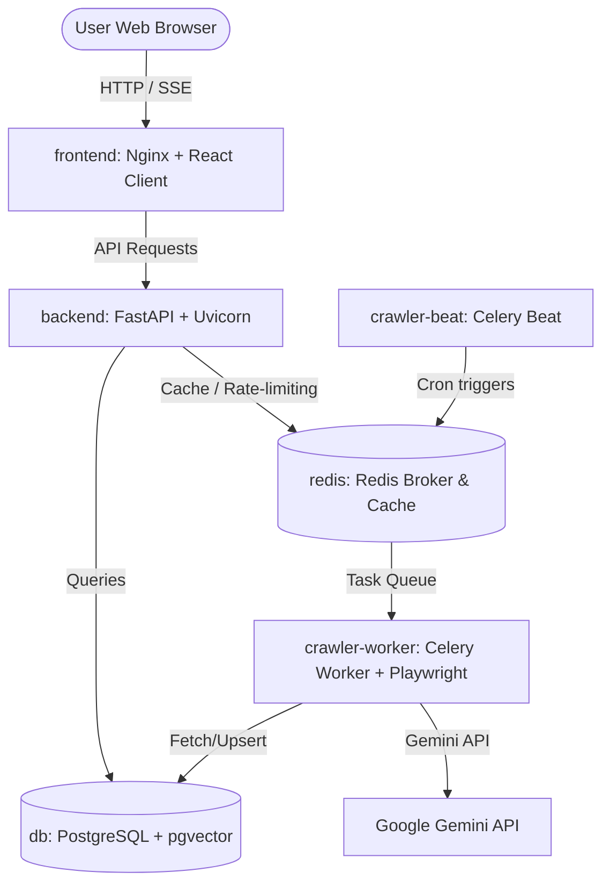

# ADR-07: Deployment Architecture and VPS Sizing

## Status
Proposed

## Context
The **Vietnamese IT Job Insights** system is transitioning into the production deployment phase. We need to define:
1. The containerized deployment model.
2. The list of active containers, their roles, and resource profiles.
3. The minimum hardware specifications for hosting the system on a Virtual Private Server (VPS) in a cost-effective manner.
4. Memory-safe optimizations to prevent system crashes under low-resource environments (e.g., 2 GB RAM).

### System Components (Container Context)
To support all features (crawling, embedding generation, semantic vector search, caching, REST APIs, SSE RAG assistant streaming, and dashboard analytics), the architecture requires the following containers:
* **`frontend`**: React 19 single-page application compiled using Vite and served via Nginx.
* **`backend`**: FastAPI application running on Uvicorn, serving the REST and SSE endpoints.
* **`crawler-worker`**: Celery worker executing Playwright-based crawling and embedding pipelines.
* **`crawler-beat`**: Celery Beat scheduler initiating cron jobs.
* **`db`**: PostgreSQL 16 database equipped with the `pgvector` extension for structured and vector data.
* **`redis`**: Redis instance serving as the Celery message broker and the cache layer.

---

## Decision
We will deploy the entire stack using a single-node **Docker Compose** deployment topology on a Linux VPS. This matches our client-server architecture decisions and keeps hosting costs low.

### 1. VPS Sizing Specifications

To balance low cost with reliable operations, we establish the following minimum and recommended hardware specifications:

| Resource | Minimum Specification | Recommended Specification |
| :--- | :--- | :--- |
| **CPU** | 2 vCPUs (1 Core is insufficient due to Chromium/Playwright load) | 2 vCPUs or 4 vCPUs |
| **RAM** | 2 GB Physical RAM (with **2-4 GB Swap** file enabled) | 4 GB Physical RAM (with **2 GB Swap**) |
| **Storage** | 20 GB SSD (SATA or NVMe) | 40 GB NVMe SSD |
| **OS** | Ubuntu 22.04 LTS / Debian 12 | Ubuntu 22.04 LTS |

> [!WARNING]
> Running the stack on a 2 GB RAM VPS without configuring a Swap file will result in the Linux kernel OOM (Out Of Memory) killer terminating Postgres or Chromium processes during scraping/indexing peaks.

### 2. Container Layout and Configuration

### 3. Low-Resource Optimizations

To guarantee stability under the minimum 2 GB RAM VPS tier, we mandate the following container configurations:

#### A. PostgreSQL Configuration (`db`)
Instead of database defaults which assume abundant memory:
* `shared_buffers`: Set to `256MB` (allocates 12.5% of 2 GB RAM).
* `work_mem`: Set to `16MB` (prevents memory exhaustion during concurrent query sort scans).
* `maintenance_work_mem`: Set to `64MB` (used for pgvector HNSW index generation).
* `max_connections`: Capped at `50` to reduce connection memory overhead.

#### B. Redis Configuration (`redis`)
* Disable disk persistence logging (`save ""`) to save memory buffers and prevent Disk I/O bottlenecks.
* Enable max memory eviction: `maxmemory 128mb` and `maxmemory-policy allkeys-lru`.

#### C. Celery Worker Configuration (`crawler-worker`)
* Run with `--concurrency=1` to limit parallel Playwright processes to a single worker subprocess.
* Configure memory limits: `worker_max_memory_per_child=250000` (250 MB limit) and `worker_max_tasks_per_child=10` to automatically recycle workers and clear Chromium leaks.
* Launch headless Chromium with `--disable-dev-shm-usage`, `--no-sandbox`, and `--disable-gpu` to minimize memory usage.

#### D. Nginx Frontend Config (`frontend`)
* Configure caching headers for static assets and enable Gzip compression to reduce VPS network bandwidth and CPU cycles.

---

## Consequences
* **Hosting Cost:** The application can run stably on low-cost $5/month cloud VPS servers (e.g., Hetzner, DigitalOcean, Vultr).
* **Robustness:** Configuring Linux Swap buffers guarantees that temporary memory spikes from browser instances do not crash critical database/API containers.
* **Orchestration Simplicity:** All services are started using a single `docker-compose.prod.yml` file, making CD deployments as simple as `docker compose up -d --build`.
