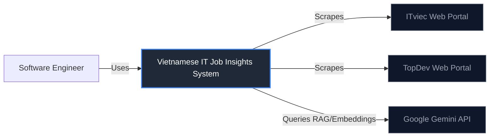

```mermaid
graph TD
    User([Software Engineer]) -->|Visits| Frontend[Frontend SPA: React + Nginx]
    Frontend -->|API & SSE Requests| Backend[Backend API: FastAPI]

    Backend -->|Read/Write Jobs| DB[(Database: PostgreSQL + pgvector)]
    Backend -->|Read/Write Cache| Redis[(Cache & Broker: Redis)]

    Beat[Crawler Beat: Celery Beat] -->|Pushes Cron| Redis
    Redis -->|Dispatches Tasks| Worker[Crawler Worker: Celery + Playwright]

    Worker -->|Saves Jobs| DB
    Worker -->|Generates Vectors| Gemini[Google Gemini API]

    style Frontend fill:#111827,stroke:#3b82f6,stroke-width:1px
    style Backend fill:#111827,stroke:#10b981,stroke-width:1px
    style DB fill:#111827,stroke:#f59e0b,stroke-width:1px
    style Redis fill:#111827,stroke:#ef4444,stroke-width:1px
    style Worker fill:#111827,stroke:#8b5cf6,stroke-width:1px
    style Beat fill:#111827,stroke:#ec4899,stroke-width:1px
```

# Phase 6: Docker Packaging and Archival Policies Plan

This document outlines the detailed execution plan for Phase 6, covering multi-container Docker Compose packaging, Nginx routing, and PostgreSQL cold storage archival to Parquet files.

---

## 1. C4 Architecture Diagrams

Below are the **C4 Context** and **C4 Container** diagrams modeled using **Structurizr DSL** and rendered as **Mermaid** graphics for visualization.

### A. C4 System Context

#### Structurizr DSL
```structurizr
workspace {
    model {
        user = person "Software Engineer" "A developer looking for IT jobs and market trends in Vietnam."
        gemini = softwareSystem "Gemini API" "Google's LLM API for generating embeddings and streaming chatbot responses." "External System"
        itviec = softwareSystem "ITviec Web" "Vietnamese IT job portal." "External System"
        topdev = softwareSystem "TopDev Web" "Vietnamese IT job portal." "External System"

        system = softwareSystem "Vietnamese IT Job Insights" "Aggregates job listings, analyzes trends, and provides an AI chatbot." {
            tags "Target System"
        }

        user -> system "Uses to search jobs, view analytics, and chat with AI assistant"
        system -> gemini "Generates embeddings and fetches RAG streaming responses"
        system -> itviec "Scrapes recruitment HTML pages"
        system -> topdev "Scrapes recruitment HTML pages"
    }

    views {
        systemContext system "SystemContext" {
            include *
            autolayout lr
        }
        theme default
    }
}
```

#### Mermaid Visual Representation


---

### B. C4 Container Model

#### Structurizr DSL
```structurizr
workspace {
    model {
        user = person "Software Engineer"
        gemini = softwareSystem "Gemini API"

        system = softwareSystem "Vietnamese IT Job Insights" {
            frontend = container "Frontend SPA" "Served via Nginx. Single Page App providing dashboard UI." "React 19 + Tailwind v4 + Recharts"
            backend = container "Backend API" "FastAPI application handling business logic and REST/SSE endpoints." "Python + FastAPI"
            db = container "Database" "Relational database storing jobs, companies, and pgvector embeddings." "PostgreSQL + pgvector"
            redis = container "Cache & Message Broker" "Redis database for Celery tasks queueing and analytics cache-aside." "Redis"
            worker = container "Crawler Worker" "Celery worker scraping listings pages and building vector indexes." "Python + Playwright + Celery"
            beat = container "Crawler Beat Scheduler" "Celery Beat instance scheduling daily crawler runs and data archival." "Python + Celery Beat"
        }

        user -> frontend "Visits using web browser"
        frontend -> backend "Makes API and SSE streaming requests" "JSON/HTTPS"
        backend -> db "Reads/Writes job records and search vectors" "SQL/SQLAlchemy"
        backend -> redis "Fetches cached analytics and registers sessions" "Redis Protocol"
        backend -> worker "Triggers manual crawling triggers" "Celery Protocol"

        beat -> redis "Pushes scheduled crawl and archival tasks" "Celery Protocol"
        redis -> worker "Dispatches tasks" "Celery Protocol"
        worker -> db "Inserts crawled job posts" "SQL/SQLAlchemy"
        worker -> gemini "Generates vector embeddings" "HTTPS"
    }

    views {
        container system "Containers" {
            include *
            autolayout lr
        }
        theme default
    }
}
```

#### Mermaid Visual Representation


---

## 2. Phase 6 Tasks Breakdowns

### Task 1: Nginx Configuration & Routing
* Create `frontend/nginx.conf` routing configuration:
  * Serve statically compiled React output (`/dist`) on Port 80.
  * Set Gzip compression filters for JavaScript, CSS, and HTML files.
  * Add reverse proxy routing: prefix `/api/v1/` gets forwarded to FastAPI backend container `http://backend:8000/api/v1/`.

### Task 2: Production Containerization (Dockerfiles)
* Write `backend/Dockerfile.prod` (Multi-stage, slim Python base).
* Write `frontend/Dockerfile.prod` (Stage 1: build Vite app; Stage 2: serve via lightweight Nginx Alpine).
* Write `crawler/Dockerfile.prod` (Slim Python base equipped with headless Chromium system packages and Playwright drivers).

### Task 3: Docker Compose Assembly (`docker-compose.prod.yml`)
* Assemble standard production stack inside the root directory.
* Configure services: `db`, `redis`, `backend`, `crawler-worker`, `crawler-beat`, `frontend`.
* Integrate health checks (`pg_isready` for Postgres, `redis-cli ping` for Redis) to sequence service startups.
* Configure strict system resource limits:
  * Limit `crawler-worker` CPU to `1.0` cores and memory to `512MB` to prevent Playwright memory leak host freeze.
  * Limit `db` memory to `512MB`.

### Task 4: Database Archival Policy (Parquet Cold-Storage)
* Create `backend/app/modules/jobs/archival_service.py`:
  * Query jobs with soft-deleted state (`is_deleted=True`) or older than 90 days.
  * Export columns (Title, Salary, Description, Skills, Company name) to PyArrow table.
  * Write compressed Parquet files to a shared volume path `/app/cold-storage/jobs_YYYY_MM.parquet`.
  * Delete successfully archived jobs from PostgreSQL to shrink index and DB footprint.
* Define a Celery task `archive_stale_jobs_task` inside `crawler/tasks.py` to run weekly at 1:00 AM on Sundays.

---

## 3. Deployment Verification Plan

1. **Local Compose Check:** Run `docker compose -f docker-compose.prod.yml up -d --build` on local system.
2. **Proxy Check:** Open browser, visit `http://localhost/` to verify React UI is loaded, and check that API calls to `http://localhost/api/v1/jobs` are correctly proxied.
3. **Archival Dry Run:** Execute pytest checking that the archival method correctly creates Parquet files and deletes old database rows.
