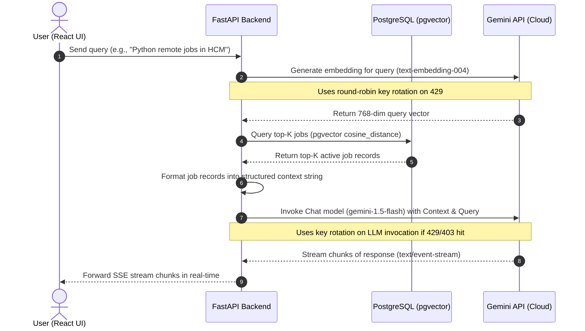

# RAG Workflow Execution Plan - Phase 3

This document details the architectural design, workflow diagrams, prompt strategies, and step-by-step execution tasks for building the RAG (Retrieval-Augmented Generation) virtual assistant.

---

## 1. RAG System Architecture & Sequence Flow

The following diagram illustrates how user questions are processed, retrieved, augmented, and streamed in real-time.



---

## 2. Step-by-Step Execution Plan

### Step 1: Install Dependencies
* Update `backend/pyproject.toml` to declare required LangChain dependencies or equivalent lightweight packages:
  * `langchain-core` (contains base prompts, schemas, message classes).
  * `httpx` (already installed; used to call Gemini REST streaming endpoint directly to maintain low resource overhead and implement manual key rotation for streaming).
  * *Note:* Calling the Gemini REST streaming API directly is highly recommended as it allows us to reuse our `GeminiEmbeddingService` key-rotation pattern for streaming without relying on heavy langchain integration libraries which might lock key configuration.

### Step 2: Define System Prompt & Context Formatter
* **Context Formatter:** Write a helper function in a new service `backend/app/modules/jobs/rag_service.py` to format retrieved database job postings into a clean, markdown structured block:
  ```markdown
  ---
  Job ID: [id]
  Title: [title]
  Company: [company_name]
  Location: [address]
  Salary: [salary_min] - [salary_max] [currency] ([salary_raw])
  Seniority: [seniority]
  Remote Policy: [remote_policy]
  Employment Type: [employment_type]
  Description: [description]
  Requirements: [requirements]
  Link: [url]
  ---
  ```
* **System Prompt:** Instruct the LLM with strict guardrails:
  * You are a polite virtual assistant for Vietnamese Software Engineers looking for jobs.
  * Answer the query **ONLY** using the provided job listings in the context.
  * If the context does not contain enough information to answer, state clearly: "I cannot find any matching jobs in the current database."
  * Do not hallucinate or manufacture job details (salaries, links, contact info).
  * Answer in Vietnamese (or match the user's language query).
  * Always provide clickable markdown links from the `Link` field of matching jobs in your answer.

### Step 3: Implement GeminiChatService (with Key Rotation & Streaming)
* Create `GeminiChatService` inside `backend/app/modules/jobs/rag_service.py`.
* Implement `async def stream_chat(self, query: str, history: list) -> AsyncGenerator[str, None]`:
  * Split `settings.GEMINI_API_KEY` to support rotating free keys.
  * Query similarity search endpoint using `JobService.search_jobs_semantically` (obtains top-5 relevant jobs).
  * Construct system instruction prompt and user prompt (including history & job context).
  * Hit Gemini streaming endpoint (`models/gemini-1.5-flash:streamGenerateContent?key=API_KEY`).
  * Yield chunks of generated text back.
  * If the API key returns a 429 (Rate Limit) or 403 (Quota Exceeded), rotate key and retry the LLM invocation from the beginning.

### Step 4: Expose FastAPI REST Chat Route
* Register the assistant module/routes in `backend/app/modules/jobs/routers.py` (or create a dedicated `assistant` module if preferred, but keeping it inside `jobs` is clean and layered).
* Expose `POST /jobs/chat`:
  * Request payload:
    ```json
    {
      "message": "User query here",
      "history": [
        {"role": "user", "content": "previous message"},
        {"role": "model", "content": "previous assistant reply"}
      ]
    }
    ```
  * Response type: `text/event-stream` using FastAPI's `StreamingResponse`.

### Step 5: Write Pytest Unit/Integration Tests
* Mock Gemini `streamGenerateContent` API endpoints using `unittest.mock`.
* Verify that:
  * Prompt context is formatted correctly.
  * The stream yields text chunks successfully.
  * Key rotation triggers if the first key returns a 429 during chat streaming.

---

## 3. Data Schema Specifications

### Chat Request Schema
```python
from pydantic import BaseModel
from typing import List, Optional

class ChatMessage(BaseModel):
    role: str  # "user" | "model"
    content: str

class ChatRequest(BaseModel):
    message: str
    history: Optional[List[ChatMessage]] = []
```

---

## 4. Prompt Engineering Guardrails

To prevent typical LLM prompt injection and hallucination:
1. **Factual Constraints:** "Evaluate the provided context jobs. If none of the jobs match the criteria requested by the user, explain that no matching job was found in the database. Do not recommend jobs that are not in the context."
2. **Formatting Constraint:** "When listing jobs, format them in bullet points containing: Job Title, Company Name, Salary, Location, and the URL link formatted as a markdown link: [Xem chi tiết tại đây](url)."
3. **Safety Constraint:** "Never respond to queries unrelated to Software Engineering recruitment, careers, or job search in Vietnam. Politely redirect the user."
